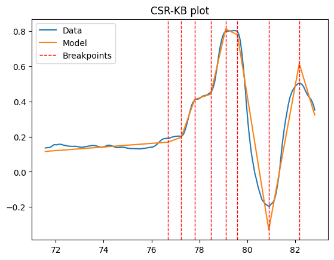

# CSR-KB - continuous segmented regression with known breakpoints

This repo implements an optionally weighted CSR-KB model with various methods and optional $L_2$ regularisation. It additionally contains a function to plot the resultant model. 

**Mathematical details of implementation:**

[](https://github.com/SebFoulger/CSR-KB/actions/workflows/build_latex.yaml)

[Download latest PDF](https://nightly.link/SebFoulger/CSR-KB/workflows/build_latex.yaml/main/PDF.zip)

## What is the CSR-KB problem?

Say there are $m$ segments s.t. segment $j$ is intended to have linear regression $y_j = X_j \beta_j$ and is of size $s_j$ where

$$y_j = \begin{pmatrix}
y_{j,1} \\
\vdots \\
y_{j,s_j}
\end{pmatrix}, X_j = 
\begin{bmatrix}
-x_{j,1}-  \\
\vdots \\
-x_{j,s_j}-
\end{bmatrix}, \beta_j = 
\begin{pmatrix}
\beta_{j,1}  \\
\vdots \\
\beta_{j,d}
\end{pmatrix}.$$

Then the continuous segmented regression problem with known breakpoints (CSR-KB) is

$$\min_{\beta_1,...,\beta_m} \sum_{j=1}^m  (y_j-X_j\beta_j)^T(y_j-X_j\beta_j)$$

such that

$$x_{j, 1}^T \beta_j = x_{j, 1}^T \beta_{j-1}, \text{ for }j=2, ..., m.$$

This is the standard (segmented) linear regression setup, but with constraints to ensure the outputted piecewise linear model is continuous.

## Usage

The main usage is as follows:
```python
from main import CSR_KB

model = CSR_KB(endog=endog, breakpoints=breakpoints, exog=exog, weights=weights, seg_weights=seg_weights, hasconst=hasconst)

betas = model.fit(method=method)
# OR
betas = model.fit_regularized(mu=mu, method=method)

model.plot(...)
```
Example plot:



The data is whitened upon instantiation of the CSR_KB object, but whitening of any ndarray can also be performed using the model weights as long as the ndarray has the same length as the endogenous (and exogenous) variable:
```python
x_white = model.whiten(x)
```

An example usage can be found in [example.ipynb](example.ipynb).

## Methods

There are currently four available methods for fitting the un-regularized model: 'normal', 'qr', 'qr2', 'svd'. Only 'normal' and 'svd' are implemented for the regularized model. All of these models use the method of Lagrange multipliers.
* 'normal' solves for the closed-form solution with standard matrix and vector operations.
* 'qr' uses the QR decomposition to avoid inverting any matrices, instead solving upper-triangular linear systems.
* 'qr2' uses the QR decomposition to require only the inversion of upper-triangular matrices (the R component).
* 'svd' uses the SVD decomposition to require only the inversion of diagonal matrices.

Typically the ordering of effiency of the methods from best to worst is 'svd', 'qr2', 'qr', 'normal'.
